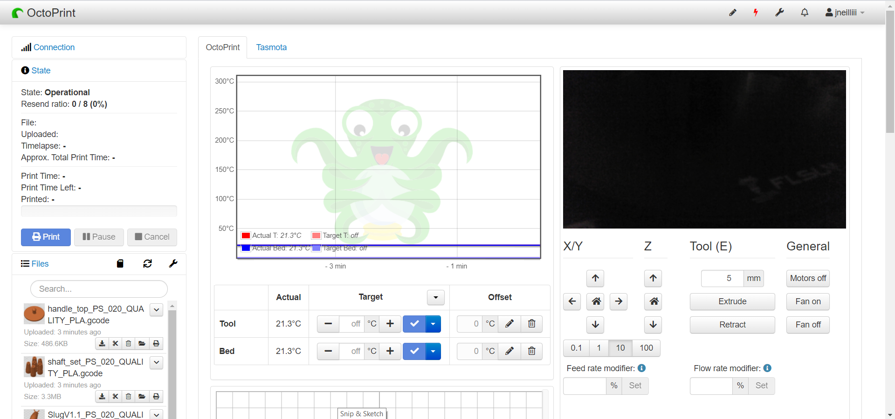

# Consolidated Tabs

This plugin will allow you to combine the selected tabs into a single tab as draggable and resizable panels.

**Note:** Initial positioning and sizing can be a little tricky due to the snapping feature between panels. You may have to move/resize and refresh the page a couple of times to get everything perfectly aligned. Once you're happy with the positions and sizes you should not have to mess with them again.

## Setup

Install via the bundled [Plugin Manager](https://docs.octoprint.org/en/master/bundledplugins/pluginmanager.html)
or manually using this URL:

    https://github.com/jneilliii/OctoPrint-ConsolidatedTabs/archive/master.zip

## Settings

* Combined Tabs Order: all the tabs that will be combined into one tab as draggable and resizable panels.
* Uncombined Tabs: tabs that have not been combined and will remain as their own tab.
* Resize Navbar: whether to resize the width of the top navbar to 100% or not.
* Remove Tab Name: don't show the name of the consolidated tab, only possible if all tabs are combined.
* Overall width: width to set the overall page container, useful for widescreen displays.
* Clear All Positions and Sizes: use the buttons to clear any position or size customizations, helpful when panels get moved off screen.

## Most Recent Release
**[0.0.4](https://github.com/jneilliii/OctoPrint-ConsolidatedTabs/releases/tag/0.0.4)** (07/26/2020)

* Fixed terminal binding (autoscroll) if tab name is hidden and all tabs combined

**[All Releases](https://github.com/jneilliii/OctoPrint-ConsolidatedTabs/releases)**

## Get Help

If you experience issues with this plugin or need assistance please use the issue tracker by clicking issues above.

## Additional Plugins

Check out my other plugins [here](https://plugins.octoprint.org/by_author/#jneilliii)

## Sponsors
- Andreas Lindermayr
- [@Mearman](https://github.com/Mearman)
- [@TxBillbr](https://github.com/TxBillbr)
- Gerald Dachs
- [@TheTuxKeeper](https://github.com/thetuxkeeper)
- @tideline3d

## Support My Efforts
I, jneilliii, programmed this plugin for fun and do my best effort to support those that have issues with it, please return the favor and leave me a tip or become a Patron if you find this plugin helpful and want me to continue future development.

 

<small>No paypal.me? Send funds via PayPal to jneilliii&#64;gmail&#46;com

You can use [this](https://www.paypal.com/cgi-bin/webscr?cmd=_xclick&business=jneilliii@gmail.com) link too. But the normal PayPal fee will be deducted.
</small>
