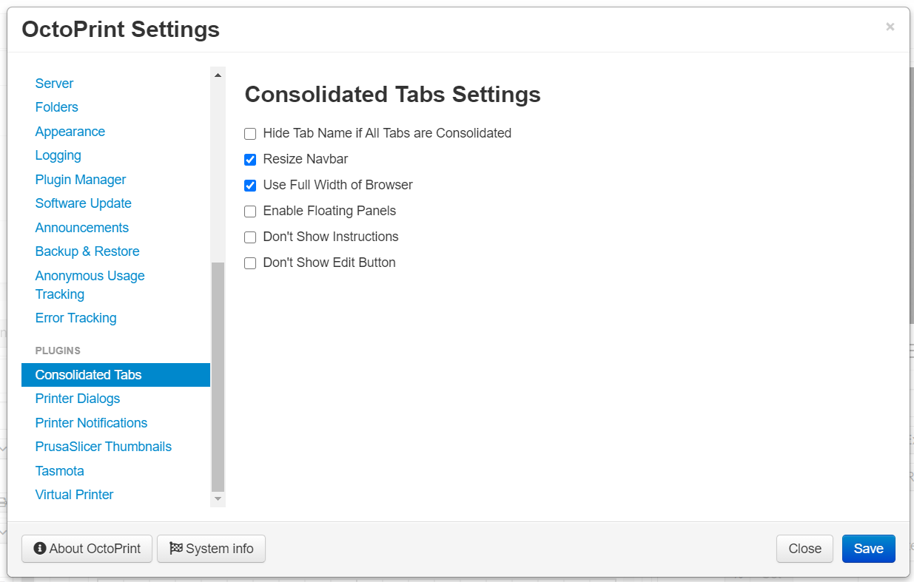

# Consolidated Tabs

This plugin will allow you to consolidate any OctoPrint tab into a single Consolidated Tab as a draggable and resizable panel. Click the screenshot below to see an example YouTube video. Since version 1.0.0 the plugin utilizes [gridstack.js](https://gridstackjs.com/) for positioning and sizing.

## Setup

Install via the bundled [Plugin Manager](https://docs.octoprint.org/en/master/bundledplugins/pluginmanager.html)
or manually using this URL:

    https://github.com/jneilliii/OctoPrint-ConsolidatedTabs/archive/master.zip

## Settings

Click the screenshot below to open a YouTube video demonstrating setting up Consolidated Tabs.

- **Resize Navbar:** whether to resize the width of the top navbar to 100% or not.
- **Remove Tab Name:** don't show the name of the consolidated tab, only possible if all tabs are consolidated.
- **Use Full Width of Browser:** if enabled the tab area will be sized to fit the entire width of the browser, and the sidebar will be moved to the left.
- **Enable Floating Panels:** if enabled the panels will not auto collapse into available open space. Can be helpful when panels are jumping around a lot.
- **Don't Show Instructions:** if enabled the instructions will not be displayed when enabling edit mode.
- **Don't Show Edit Button:** if enabled the edit button in the navbar will be hidden.

## Instructions

## Tips

- The name of the tab will match what is configured in OctoPrint's `Title` appearance setting.
- It's best to consolidate the desired tabs first and save, reload, and then enable edit mode again to resize and position.
- Panels will become full width automatically and realign once the tab's area width drops below a certain size.

## Themeify

If using Themeify you may want to add extra settings to your Advanced options. These are the relevant css selectors that you can adjust.

| Selector                                               | CSS-Rule         | Value             | Context             | Hidden Tab Name Specific |
|--------------------------------------------------------|------------------|-------------------|---------------------|--------------------------|
| .grid-stack-item.consolidated .grid-stack-item-content | background-color | #2f3136           | Each Panel          |                          |
| .grid-stack-item.consolidated .grid-stack-item-content | border           | 1px solid #fc8003 | Panels Border       |                          |
| #tabs_content                                          | box-shadow       | unset             | Tab content wrapper | Yes                      |
| #tabs_content                                          | background-color | unset             | Tab content wrapper | Yes                      |

## To-Do
* [X] ~~Figure out how to get rid of the extra whitespace at the bottom of the page after panels are positioned.~~
* [X] ~~Figure out how to get temp panel to be selected when drop-downs are selected.~~ compromised with scrolling.
* [X] ~~Add YouTube video showing placement and resizing of tabs.~~

## Most Recent Release

**[1.0.1](https://github.com/jneilliii/OctoPrint-ConsolidatedTabs/releases/tag/1.0.1)** (03/21/2021)

* resolved issue where edit button would disappear if the control tab was consolidated but there was no webcam stream URL.

### [All Releases](https://github.com/jneilliii/OctoPrint-ConsolidatedTabs/releases)

## Get Help

If you experience issues with this plugin or need assistance please use the issue tracker by clicking issues above.

## Additional Plugins

Check out my other plugins [here](https://plugins.octoprint.org/by_author/#jneilliii)

## Sponsors
- Andreas Lindermayr
- [@Mearman](https://github.com/Mearman)
- [@TheTuxKeeper](https://github.com/thetuxkeeper)
- [@tideline3d](https://github.com/tideline3d/)
- [SimplyPrint](https://simplyprint.dk/)
- [Andrew Beeman](https://github.com/Kiendeleo)
- [Calanish](https://github.com/calanish)
- [Lachlan Bell](https://lachy.io/)
- [Johnny Bergdal](https://github.com/bergdahl)
- [Leigh Johnson](https://github.com/leigh-johnson)
- [Stephen Berry](https://github.com/berrystephenw)
- [Guyot François](https://github.com/iFrostizz)
- [Steve Dougherty](https://github.com/Thynix)
- [Flying Buffalo Aerial Photography](http://flyingbuffalo.info/)
- Sam Fingard
## Support My Efforts
I, jneilliii, programmed this plugin for fun and do my best effort to support those that have issues with it, please return the favor and leave me a tip or become a Patron if you find this plugin helpful and want me to continue future development.

 

<small>No paypal.me? Send funds via PayPal to jneilliii&#64;gmail&#46;com

You can use [this](https://www.paypal.com/cgi-bin/webscr?cmd=_xclick&business=jneilliii@gmail.com) link too. But the normal PayPal fee will be deducted.
</small>
